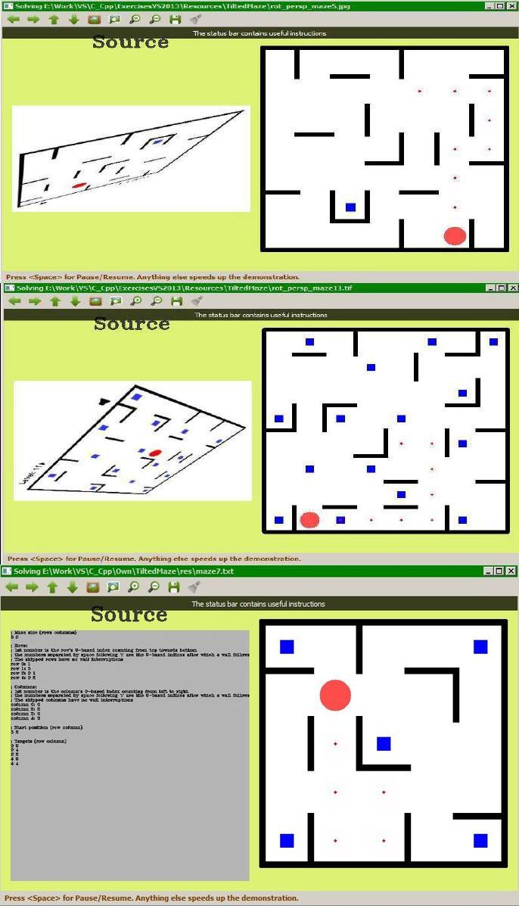

# TiltedMaze v1.0

This is a program solving tilted maze problems. Here is one such maze: 

The **token** (the red circle) needs to travel through the maze so that it visits all the **targets** (blue rectangular spots).
These are the rules about how the token is moved:

- it can move in any direction, but
- it must continue to move in that direction **until reaching a wall** (it cannot stop somewhere on the way)

The game can be played online: [http://www.agame.com/game/tilt-maze](http://www.agame.com/game/tilt-maze).

* * *

The tilted mazes solver uses Boost-Graph library. One graph algorithm from that library needed to be adapted for this problem ([graph_r_c_shortest_paths.h](src/Adapted3rdParty/graph_r_c_shortest_paths.h))

This version of the program:

- reads the mazes in text format (see [res/](res/) folder for the test mazes)
- presents the steps required to solve the maze in a console animation
- is configured for 64-bit Windows (the console animation is Windows-specific). If the animation is not important, it can be adjusted to be used on different operating systems

The image from below presents an early stage of an animation (left part of the image) and the final of that demonstration (right side of the image). The targets were represented with blue **&#39;$&#39;** signs and each move fills the traversed cells with __&#39;&#42;&#39;__ using a different color than the previous move. 

* * *

Extending the program requires:

- a Boost installation and configuring the **BoostDir** property in the file [Common.props](Common.props) with the path to the Boost installation

* * *

&copy; 2014, 2017 Florin Tulba
